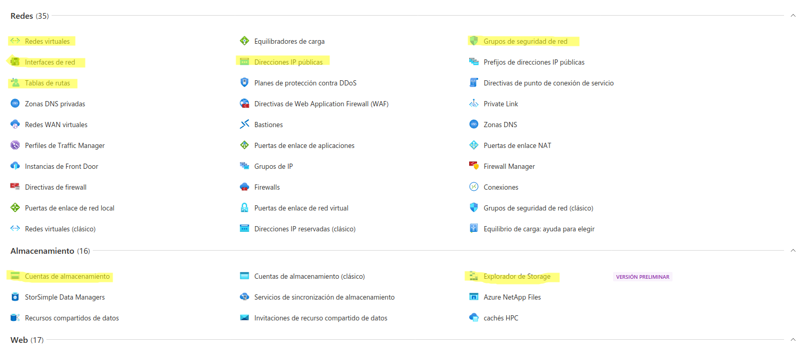

###### Reto Game of Networks
## Creación de la Infraestructura en Microsoft AZURE
#### Entrega de: *Denis Alexander Gutiérrez Salvador*
Cabe aclarar, que hay muchas más funciones de las que mostrare en está parte y opciones más optimas para realizarlas, en mi caso, me he centrado en lo que necesitaba.

#### 1. Empezando con Azure:

Empezamos logeandonos en nuestra cuenta de azure y nos aparecerá algo parecido a esto:


Para poder ver, mejor los servicios que nesitaremos en azure y asociarlo mejor con nuestros entornos virtuales, vamos a "Todos los servicios" , nos saldrá algo parecido a esto:





Parece mucho al princio, pero a medida que vayamos avanzando se podrá apreciar de cada uno su función y leendo un poco, os sonará de VirtualBox, VMWare o Hyper-V.

Empezaremos creadonos un grupo de recursos, que vendría siendo como una carpeta, en la cual almacenaremos todos nuestros recursos, <i>Redes Virtuales, Máquinas Virtuales, Discos Duros </i> etc. 

Seleccionamos <b>Grupos de Recursos </b>:


Una vez dentro, le pondremos de nombre <i> Proyecto-Reto</i> y en la Regió pondremos "(Europe) France Central":

Lás regiones, son los lugares en los cual se montan los recursos, discos duros, máquinas virtuales etc, es el entorno "Real" de nuestro recursos y <B> TODOS LOS RECURSOS TIENE QUE ESTÁR EN LA MISMA REGIÓN</B> ya que puede conllevar a fallo.

Le damos a siguiente:


Si queremos que nuestros recursos estén organizado, podemos ponerle etiquetas, en nuestro caso, ya que nuestros recursos serán pocos y dentro del grupo de recursos se puede agrupar, no lo utilizaremos y simplemente le daremos a "siguiente":


En el apartado <b>"Revisar y crear"</b> Podemos apreciar que nos hace un <i>check </i> de las cosas que hemos configurado previamente y nos indica que todo está correcto, en caso de error, nos saldría en color rojo un error.

Le damos a<b> "Crear"</b>.


Una vez creado nuestro grupo de recursos, nos saldrá algo parecido a esto:


Como podemos apreciar, nos saldrá vacía ya que no hemos creado ningún recurso (de momento).


#### 2. Creación de Recursos:

Pinchamos en la parte superior izquierda en "Micrososft Azure" y al apartado "Todos los servicios" y vamos al apartado "Redes":


Nos saldrá algo parecido a esto:


le damos a "crear" y empezamos:

Seleccionamos nuestro Grupo de recursos, le ponemos el nombre que quisieramos y la región ponemos "France Central" que es la región en la cual nuestro recursos van a estár:


Crearemos las redes en base a nuestra infraestructura de red:


Crearemos la red " 172.16.0.0/16" y 2 subredes nuestro DMZ "172.16.100.0/24" y la Red-Inerna"172.16.200.0/24":


1. **Suma**: crea una función escribirSuma que reciba un número n  y calcule la suma de los n primeros números naturales. Por ejemplo si el número introducido es 4, escribiremos el resultado de sumar 1 + 2 + 3 + 4.   Comprobaciones previas: que el número sea mayor que cero

- Recomendación: resuelve primero el problema sin función, fijando tú el valor del número. Una vez lo tengas añade la estructura de función.
- Recomendación: Necesitarás tener una variable acumuladora en la que vayas almacenando la suma parcial. Los acumuladores...
  - Se inicializan antes del bucle: si lo haces dentro del bucle se inicializarán a cada vuelta
  - Se imprimen después del bucle: si lo haces dentro del bucle se irán imprimiendo los valores parciales
  
  Solución:


```php+html

```

2. **Potencia**: función escribirPotencia que reciba dos números a y b y calcule la potencia a elevado a b utilizando iteraciones (no una función matemática predefinida). Por ejemplo, calcularemos `2^3` como `2*2*2`. Utilizar estructura "while"

- Pista: el exponente (3 en el ejemplo) es el que actúa de contador y te sirve para ajustar el número de veces que multiplicamos

  Solución:


```php+html

```

3. **Factorial**: función obtenerFactorial que reciba un número x y calcule su factorial utilizando iteraciones. Utilizar estructura "for"
   - Pista: este ejercicio es muy parecido al primero de suma, pero con multiplicaciones en lugar de sumas

```php+html

```

4. **Strings como arrays**. Codifica una función `escribirLetras` que reciba un texto y escriba una lista ordenada con sus letras una a una, por ejemplo:

```
1. h
2. o
3. l
4. a
```

Solución:

```php+html

```

5. **Espejo**: Crea una función `escribirEspejo` que reciba un texto y escriba su espejo: por ejemplo si escribo "hola a todos" el programa escribirá "sodot a aloh"

6. * Recomendación: comienza haciendo una versión en la que escribas el texto al derecho ("hola a todos") pero carácter a carácter. Cuando lo tengas funcionando, será más sencillo darle la vuelta

   Solución:

```php+html

```

7. **Recorte**: función `escribirRecorte` que reciba una cadena de texto y la muestre varias veces: en cada línea se mostrará un carácter menos que en la anterior. Este ejercicio es algo más complejo ya que requiere un bucle interno (un bucle dentro de otro).

* Recomendación: empieza haciendo una versión en la que "Mi casa" (frase de 7 caracteres) aparezca completa siete veces en forma de párrafos:
```
   Mi casa
   Mi casa
   Mi casa
   Mi casa
   Mi casa
   Mi casa
   Mi casa
```

* Cuando lo tengas funcionando, debes lograr lo mismo pero de forma que cada uno de los párrafos se escriba letra a letra: es decir, añadirás un bucle interno en el que repetirás algo parecido a lo que hiciste en el ejercicio 4 (pero sin listas).

* Ahora intenta utilizar el contador del bucle externo para que quede un resultado así:

```
   Mi casa
   Mi cas
   Mi ca
   Mi c
   Mi 
   Mi
   M 
```
Solución: 

```php+html

```

8. **Notas**. Almacenar las notas de varios módulos (por ejemplo IAW, SRI y EIE) y escribir en pantalla la nota media. A la hora de calcular la media, no escribas manualmente "3": averigua cuántos módulos hay utilizando la función adecuada.

   Solución: 

```php+html

```

9. **Agenda**:  Codifica una agenda telefónica en forma de array asociativo y añade algunos contactos para que haya al menos seis elementos. Codifica un programa que muestre la agenda en forma de tabla: la columna izquierda serán los nombres y la columna derecha los números. Incluye cabeceras de tabla para indicar el contenido de cada columna. Cuando lo tengas resuelto, modifica el programa para que las celdas pares se muestren con un fondo de color claro (por ejemplo *lightblue*, *lightgray*, etc).

   Solución:


